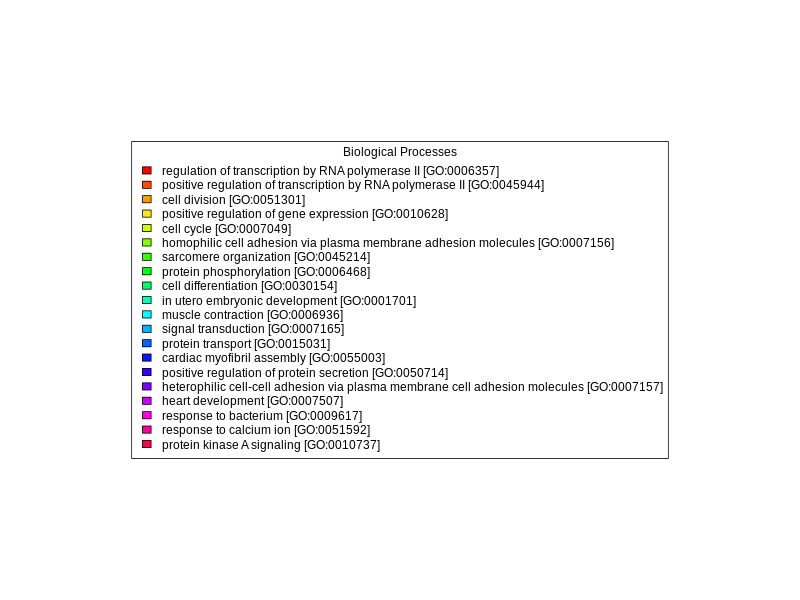

```{r setup, include=FALSE}
knitr::opts_chunk$set(echo = TRUE)
```

There are some packages that are used in this process including Dplyr, Stringr, ggplot2, and DT. Packages are installed/loaded here (disregard chunk if already loaded)

```{r}

# if you need to install, uncomment the following: 
# install.packages("BiocManager")
# BiocManager::install("Biostrings")
# install.packages("ggplot2")
install.packages('DT')
# install.packages('dplyr')
# install.packages('stringr')

# load installed packages
library(BiocManager)
library(Biostrings)
library(ggplot2)
library(DT)
library(dplyr)
library(stringr)


```

## Database Creation

This part is [**not unique to the file**]{.underline}, it is creating the database you will use when running blast on your file (ie. you don't need to change this section with each different file of interest).

### Obtain Fasta (UniProt/Swiss-Prot)

```{bash}
cd ../data
curl -O https://ftp.uniprot.org/pub/databases/uniprot/current_release/knowledgebase/complete/uniprot_sprot.fasta.gz
mv uniprot_sprot.fasta.gz uniprot_sprot_r2024_02.fasta.gz
gunzip -k uniprot_sprot_r2024_02.fasta.gz
```

### Making the Database

```{bash}
mkdir ../blastdb
/home/shared/ncbi-blast-2.15.0+/bin/makeblastdb \
-in ../data/uniprot_sprot_r2024_02.fasta \
-dbtype prot \
-out ../blastdb/uniprot_sprot_r2024_02
```

## Getting the query fasta file

This is where you start changing things for your specific [**file of interest.**]{.underline}

You use curl to retrieve your file from gannet (or whatever server it is stored on).

```{bash}
wget -O ../data/olurida_transcriptome_v3.fasta http://eagle.fish.washington.edu/cnidarian/Olurida_transcriptome_v3.fasta

```

```         
```

Taking a peek at that file via `head()` and getting a count of sequences

```{bash}

head -3 ../data/olurida_transcriptome_v3.fasta

```

```{bash}

echo "How many sequences are there?"
grep -c ">" ../data/olurida_transcriptome_v3.fasta

```

## Running Blast

We run blast since it is a protein file.

```{bash}

/home/shared/ncbi-blast-2.15.0+/bin/blastx \
-query ../data/olurida_transcriptome_v3.fasta \
-db ../blastdb/uniprot_sprot_r2024_02 \
-out ../output/olurida_blastout.tab \
-evalue 1E-20 \
-num_threads 20 \
-max_target_seqs 1 \
-outfmt 6

```

Peeking at the output file

```{bash}
head -2 ../blastdb/uniprot_sprot_r2024_04
```

```{bash}
echo "Number of lines in output"
wc -l ../output/olurida_blastout.tab
```

## Joining Blast Table with Annotations

### Prepping Blast table for easy join

```{bash}

tr '|' '\t' < ../output/olurida_blastout.tab \
> ../output/olurida_blastout_sep.tab

#peeking to make sure it looks as expected
head -1 ../output/olurida_blastout_sep.tab


```

## Blast Result Visualization

" Could do some cool stuff in R here reading in the table "

Save our output file and reference uniprot table as objects

```{r}

bltabl <- read.csv("../output/olurida_blastout_sep.tab", sep = '\t', header = FALSE)

spgo <- read.csv("https://gannet.fish.washington.edu/seashell/snaps/uniprot_table_r2023_01.tab", sep = '\t', header = TRUE)

```

Load packages and create data tables of output file and uniprot reference. Uses the DT package.

```{r}

datatable(head(bltabl), options = list(scrollX = TRUE, scrollY = "400px", scrollCollapse = TRUE, paging = FALSE))
```

```{r}
datatable(head(spgo), options = list(scrollX = TRUE, scrollY = "400px", scrollCollapse = TRUE, paging = FALSE))
```

Join the two datatables you created. Uses dplyr and stringr

```{r}

datatable(
  left_join(bltabl, spgo,  by = c("V3" = "Entry")) %>%
  select(V1, V3, V13, Protein.names, Organism, Gene.Ontology..biological.process., Gene.Ontology.IDs) 
  %>% mutate(V1 = str_replace_all(V1, 
            pattern = "solid0078_20110412_FRAG_BC_WHITE_WHITE_F3_QV_SE_trimmed", replacement = "Ab"))
)

```

Same code as above but saved as object

```{r}

annot_tab <-
  left_join(bltabl, spgo,  by = c("V3" = "Entry")) %>%
  select(V1, V3, V13, Protein.names, Organism, Gene.Ontology..biological.process., Gene.Ontology.IDs) %>% mutate(V1 = str_replace_all(V1, 
            pattern = "solid0078_20110412_FRAG_BC_WHITE_WHITE_F3_QV_SE_trimmed", replacement = "Ab"))

```

Get string counts, and create a plot of top 10 which will provide "top 10 species hits"

```{r}

# Read dataset
dataset <- read.csv("../output/olurida_blastout.tab", sep = '\t', header = FALSE)  # Replace with the path to your dataset

# Select the column of interest
#dataset$V1 <- "Organism"  # Replace with the name of the column of interest
#column_data <- dataset[[V]]

# Count the occurrences of the strings in the column
string_counts <- table(dataset$V2)

# Convert to a data frame, sort by count, and select the top 10
string_counts_df <- as.data.frame(string_counts)
colnames(string_counts_df) <- c("String", "Count")
string_counts_df <- string_counts_df[order(string_counts_df$Count, decreasing = TRUE), ]
top_10_strings <- head(string_counts_df, n = 10)

# Plot the top 10 most common strings using ggplot2
ggplot(top_10_strings, aes(x = reorder(String, -Count), y = Count, fill = String)) +
  geom_bar(stat = "identity", position = "dodge", color = "black") +
  labs(title = "Top 10 Species hits",
       x = dataset$V2,
       y = "Count") +
  theme_minimal() +
  theme(legend.position = "none") +
  coord_flip()


```

Produces graph of top 20 biological processes

-   note that the legend identifying what each column is, is saved as a png in the output folder in the last chunk of code.

```{r}
data <- annot_tab

# Rename the `Gene.Ontology..biological.process.` column to `Biological_Process`
colnames(data)[colnames(data) == "Gene.Ontology..biological.process."] <- "Biological_Process"

# Separate the `Biological_Process` column into individual biological processes
data_separated <- unlist(strsplit(data$Biological_Process, split = ";"))

# Trim whitespace from the biological processes
data_separated <- gsub("^\\s+|\\s+$", "", data_separated)

# Count the occurrences of each biological process
process_counts <- table(data_separated)
process_counts <- data.frame(Biological_Process = names(process_counts), Count = as.integer(process_counts))
process_counts <- process_counts[order(-process_counts$Count), ]

# Select the 20 most predominant biological processes
top_20_processes <- process_counts[1:20, ]

# Create a color palette for the bars
bar_colors <- rainbow(nrow(top_20_processes))

# Create a staggered vertical bar plot with different colors for each bar
barplot(top_20_processes$Count, names.arg = rep("", nrow(top_20_processes)), col = bar_colors,
        ylim = c(0, max(top_20_processes$Count) * 1.25),
        main = "Occurrences of the 20 Most Predominant Biological Processes", xlab = "Biological Process", ylab = "Count")


# Create a separate plot for the legend
png("../output/GOlegend.png", width = 800, height = 600)
par(mar = c(0, 0, 0, 0))
plot.new()
legend("center", legend = top_20_processes$Biological_Process, fill = bar_colors, cex = 1, title = "Biological Processes")
dev.off()
```

```{r}

```
